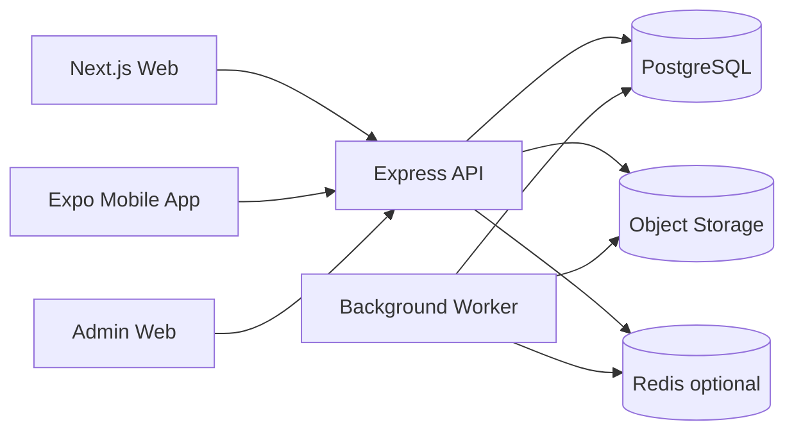

# ĐẶC TẢ CƠ SỞ DỮ LIỆU BEEBUDDY V2

> **Trạng thái:** Database Foundation P0 M1–M6 đã triển khai trên staging và development  
> **Ngày lập:** 24/09/2026  
> **Phạm vi:** PostgreSQL dùng chung cho Web, Mobile App và Admin  
> **Schema hiện tại:** `backend/prisma/schema.prisma` là baseline MVP, không phải schema đích

---

## 1. Mục tiêu

Database V2 phải đáp ứng đồng thời:

1. Web giới hạn: public feed, comment, search preview, account, legal, payment và admin.
2. Mobile core: onboarding sâu, matching, follow, connection, post, community, chat và notification.
3. Gói FREE/VIP/PRO mở quyền theo cấu hình dữ liệu, không hard-code rải rác trong API.
4. Mascot AI có dữ liệu đủ để hỗ trợ người dùng nhưng không được hành động thay người dùng.
5. Audit, privacy, moderation, payment và quyền truy cập có thể kiểm chứng tại database.
6. Mở rộng theo từng lát cắt mà không phải phá vỡ dữ liệu hoặc API đã hoạt động.

Database V2 không yêu cầu triển khai tất cả chức năng ngay lập tức. Tài liệu này xác định schema đích và thứ tự migration an toàn.

---

## 2. Quyết định nghiệp vụ đã chốt

Ngoài bốn nguyên tắc nghiệp vụ bên dưới, nhóm đã xác nhận ngày 24/09/2026:

- Database hiện tại chỉ chứa dữ liệu development/seed, không có dữ liệu người dùng hoặc payment thật cần bảo toàn.
- Duyệt toàn bộ danh sách model P0 tại mục 19.
- Duyệt bộ default privacy tại mục 7.4.
- Reset `likesCount` seed legacy về `0` khi chuyển sang `PostReaction`; không tạo reaction giả.
- Migration được chia theo domain và chạy thử trên database `beebuddy_v2_staging` trước database development chính.

### 2.1. Follow và Connection là hai quan hệ khác nhau

- `Follow`: một chiều, không cần người được follow chấp nhận.
- `Connection`: hai chiều, bắt đầu bằng lời mời và chỉ có hiệu lực sau khi chấp nhận.
- Chỉ connection đã chấp nhận mới được xem nội dung `CONNECTIONS` và mở chat 1-1.
- Block là một quan hệ riêng, có ưu tiên cao hơn follow, connection, search và messaging.

### 2.2. Community và Group Chat là hai khái niệm khác nhau

- `Community`: có hồ sơ, quyền riêng tư, thành viên, role và feed bài viết.
- `Group Chat`: là một `Conversation` nhiều thành viên.
- Một Community có thể chứa nhiều Group Chat.
- Group Chat cũng có thể tồn tại độc lập ngoài Community.

### 2.3. Privacy áp dụng theo từng nhóm thông tin hồ sơ

Mỗi nhóm thông tin có audience riêng:

- `PUBLIC`
- `CONNECTIONS`
- `ONLY_ME`

Ví dụ avatar có thể public, trong khi tuổi hoặc thói quen chỉ dành cho connections.

### 2.4. Gói cước sử dụng entitlement

- `Plan` mô tả FREE/VIP/PRO.
- `Feature` mô tả một quyền hoặc hạn mức.
- `PlanFeature` ánh xạ gói với quyền/hạn mức.
- API kiểm tra entitlement thay vì viết điều kiện `if tier == VIP` ở nhiều nơi.
- Các con số giới hạn group/community được seed và có thể thay đổi sau.

---

## 3. Kiến trúc dữ liệu tổng thể



Quy tắc:

- PostgreSQL là nguồn dữ liệu chính duy nhất.
- Web và Mobile không kết nối trực tiếp tới PostgreSQL.
- Ảnh, video, voice và file nằm trong object storage; database chỉ lưu metadata và object key.
- Redis chỉ dùng cho cache, presence, rate limit và queue; không phải nguồn dữ liệu vĩnh viễn.
- Worker xử lý notification, media processing, moderation và AI job bất đồng bộ.

---

## 4. Quy ước kỹ thuật

### 4.1. Kiểu dữ liệu và thời gian

- Primary key và foreign key mới dùng PostgreSQL `uuid` native.
- Thời gian dùng `timestamptz(3)` và lưu theo UTC.
- Email chuẩn hóa lowercase và unique không phân biệt hoa/thường, ưu tiên extension `citext`.
- Tiền tệ lưu bằng `Decimal`, không dùng floating point.
- Không lưu binary media trực tiếp trong PostgreSQL.

### 4.2. Xóa dữ liệu

- User, Profile, Post, Comment, Community và Message dùng soft-delete khi cần phục hồi/audit.
- Payment, webhook event, consent và audit log không cascade-delete theo User.
- Yêu cầu xóa tài khoản được ghi nhận bằng `UserDataRequest`; worker thực hiện anonymize theo chính sách.

### 4.3. Enum và constraint

- Trạng thái nghiệp vụ không dùng String tự do nếu tập giá trị đã biết.
- Các invariant quan trọng phải có database constraint, không chỉ kiểm tra ở UI/API.
- Check constraint được viết trong migration SQL nếu Prisma schema chưa biểu diễn được.

### 4.4. Counter

- Counter như `likesCount`, `membersCount`, `commentsCount` chỉ là cache đọc nhanh.
- Bảng fact như `PostReaction`, `CommunityMember`, `Comment` mới là nguồn sự thật.
- Mọi cập nhật counter phải nằm trong transaction và có job reconciliation.

---

## 5. ERD mức domain

```mermaid
erDiagram
    User ||--|| Profile : owns
    User ||--o{ AuthIdentity : authenticates
    User ||--o{ UserSession : opens
    User ||--o{ UserInterest : selects
    Interest ||--o{ UserInterest : categorizes
    User ||--o{ UserHabit : has
    Habit ||--o{ UserHabit : categorizes
    User ||--o{ ProfileVisibilityRule : controls

    User ||--o{ Follow : follows
    User ||--o{ Connection : connects
    User ||--o{ UserBlock : blocks

    User ||--o{ Post : authors
    Post ||--o{ PostMedia : contains
    Post ||--o{ PostReaction : receives
    Post ||--o{ Comment : receives
    Post ||--o{ PostAudienceUser : grants

    Community ||--o{ CommunityMember : contains
    User ||--o{ CommunityMember : joins
    Community ||--o{ Post : publishes

    Conversation ||--o{ ConversationMember : contains
    User ||--o{ ConversationMember : joins
    Conversation ||--o{ Message : contains
    Message ||--o{ MessageAttachment : contains

    User ||--o{ Notification : receives
    User ||--o{ DevicePushToken : registers

    Plan ||--o{ PlanFeature : grants
    Feature ||--o{ PlanFeature : defines
    User ||--o{ Subscription : owns
    Plan ||--o{ Subscription : selected
    Subscription ||--o{ Payment : billed
    Payment ||--o{ PaymentWebhookEvent : processes

    User ||--o{ Report : creates
    ModerationCase ||--o{ Report : groups
    User ||--o{ AuditLog : acts
```



ERD trên chỉ thể hiện quan hệ chính. Các model chi tiết được quy định ở các phần tiếp theo.

---

## 6. Identity, authentication và authorization

### 6.1. `User`

Giữ vai trò aggregate root của tài khoản.

| Field | Kiểu | Quy tắc |
|---|---|---|
| `id` | UUID | Primary key |
| `email` | CITEXT | Unique; nullable chỉ khi social provider chưa trả email |
| `accountStatus` | Enum | `ACTIVE`, `SUSPENDED`, `BANNED`, `DELETION_PENDING`, `DELETED` |
| `isVerified` | Boolean | Cache trạng thái xác minh |
| `currentPlanCode` | String? | Cache tương thích API; không phải nguồn entitlement |
| `currentPlanExpiresAt` | Timestamptz? | Cache tương thích API |
| `createdAt`, `updatedAt` | Timestamptz | Bắt buộc |
| `deletedAt` | Timestamptz? | Soft-delete/anonymize |

Quyết định:

- Guest không tạo bản ghi `User`; guest được đại diện bằng anonymous session khi cần consent/rate limit.
- `passwordHash` chuyển khỏi `User` sang `AuthIdentity`.
- `User.role` hiện tại được giữ tạm trong migration để tương thích, sau đó thay bằng RBAC.

### 6.2. `AuthIdentity`

| Field | Kiểu | Ghi chú |
|---|---|---|
| `id`, `userId` | UUID | FK tới User |
| `provider` | Enum | `EMAIL`, `GOOGLE`, `APPLE` |
| `providerSubject` | String | Email normalized hoặc subject từ provider |
| `passwordHash` | String? | Chỉ dành cho `EMAIL` |
| `providerEmail` | CITEXT? | Email provider trả về |
| `verifiedAt`, `lastUsedAt` | Timestamptz? | Audit |

Constraint: unique `(provider, providerSubject)`.

### 6.3. `UserSession`

Lưu refresh session để rotation/revoke được.

Các field chính:

- `id`, `userId`
- `refreshTokenHash`, không lưu token thô
- `deviceId`, `deviceName`, `platform`
- `ipAddress`, `userAgent`
- `lastUsedAt`, `expiresAt`, `revokedAt`
- `replacedBySessionId`
- `createdAt`

Index: `(userId, revokedAt, expiresAt)` và unique `refreshTokenHash`.

### 6.4. Token một lần

`OneTimeToken` hỗ trợ:

- `EMAIL_VERIFICATION`
- `PASSWORD_RESET`
- `EMAIL_CHANGE`

Chỉ lưu token hash, có `expiresAt`, `consumedAt`, `attemptCount` và unique active token theo mục đích.

### 6.5. RBAC cho Admin/Sub-Admin

Các model:

- `AdminRole`
- `AdminPermission`
- `UserAdminRole`
- `AdminRolePermission`

Role seed đề xuất:

- `SUPER_ADMIN`
- `ADMIN`
- `MODERATOR`
- `SUPPORT`
- `FINANCE`

Permission ví dụ: `users.ban`, `users.read`, `payments.read`, `tiers.adjust`, `content.moderate`, `communities.manage`, `audit.read`.

---

## 7. Profile, onboarding và matching data

### 7.1. `Profile`

Các field cốt lõi:

- `userId` unique
- `fullName`, `username` unique
- `avatarMediaId`
- `bio`
- `dateOfBirth`
- `genderIdentity`
- `occupation`, `industry`
- `locationText`, `countryCode`
- `onboardingStatus`: `NOT_STARTED`, `IN_PROGRESS`, `COMPLETED`
- `onboardingCompletedAt`
- `createdAt`, `updatedAt`, `deletedAt`

Không lưu tuổi trực tiếp; tuổi được tính từ `dateOfBirth`.

### 7.2. Taxonomy

Không tiếp tục dùng `String[]` làm nguồn dữ liệu lâu dài.

| Catalog | Bảng nối | Metadata người dùng |
|---|---|---|
| `Interest` | `UserInterest` | priority, proficiency, source |
| `Habit` | `UserHabit` | frequency, preferredTime, source |
| `Place` | `UserPlace` | relationType, isPrimary |
| `ConnectionGoal` | `UserConnectionGoal` | priority |

Mỗi catalog có:

- `id`, `slug`, `displayName`
- `categoryId` nếu cần phân cấp
- `aliases` hoặc bảng alias để tìm kiếm đa ngôn ngữ
- `isActive`, `sortOrder`
- `createdAt`, `updatedAt`

### 7.3. `ProfileMedia`

Lưu ảnh/video giới thiệu:

- `profileId`, `mediaAssetId`
- `mediaType`: `IMAGE`, `VIDEO`
- `sortOrder`
- `caption`
- `createdAt`, `deletedAt`

### 7.4. `ProfileVisibilityRule`

| Field | Giá trị |
|---|---|
| `section` | `BASIC`, `BIO`, `AGE`, `OCCUPATION`, `INTERESTS`, `HABITS`, `PLACES`, `GOALS`, `INTRO_MEDIA` |
| `audience` | `PUBLIC`, `CONNECTIONS`, `ONLY_ME` |

Unique `(userId, section)`.

Default đề xuất:

- BASIC, BIO, INTERESTS: `PUBLIC`
- AGE, OCCUPATION, PLACES, GOALS, INTRO_MEDIA: `CONNECTIONS`
- HABITS: `ONLY_ME`

User được phép đổi các default này trong giới hạn an toàn.

### 7.5. Matching mở rộng

Chưa cần triển khai ngay, nhưng schema dự kiến có:

- `MatchPreference`
- `MatchRecommendation`
- `RecommendationFeedback`

Không lưu chính xác vị trí người dùng nếu chưa cần. Matching địa lý ban đầu dùng city/district hoặc geohash làm tròn; vị trí chính xác phải có consent riêng.

---

## 8. Social graph

### 8.1. `Follow`

- `followerId`, `followingId`
- `createdAt`
- unique `(followerId, followingId)`
- check `followerId != followingId`
- index `(followingId, createdAt)` để lấy followers

### 8.2. `Connection`

| Field | Ghi chú |
|---|---|
| `requesterId` | Người gửi lời mời |
| `addresseeId` | Người nhận |
| `pairKey` | Chuỗi canonical `min(userId):max(userId)` |
| `status` | `PENDING`, `ACCEPTED`, `REJECTED`, `CANCELLED` |
| `requestedAt` | Thời điểm gửi |
| `respondedAt` | Thời điểm accept/reject |
| `endedAt` | Unfriend/cancel |

Constraint:

- unique `pairKey`
- requester khác addressee
- chỉ `ACCEPTED` mới cấp quyền connections-only và chat trực tiếp

Nếu cần lịch sử đầy đủ, thêm `ConnectionEvent` thay vì tạo nhiều row cho cùng một cặp.

### 8.3. `UserBlock`

- `blockerId`, `blockedId`, `reasonCode`, `createdAt`
- unique `(blockerId, blockedId)`
- block làm mất khả năng follow/connect/search/chat theo cả hai chiều
- unblock không tự động khôi phục connection cũ

---

## 9. Post, media, audience và tương tác

### 9.1. `Post`

| Field | Kiểu/giá trị |
|---|---|
| `authorId` | User FK |
| `communityId` | Nullable Community FK |
| `content` | Text |
| `status` | `DRAFT`, `PUBLISHED`, `ARCHIVED`, `REMOVED` |
| `audience` | `PUBLIC`, `CONNECTIONS`, `SELECTED`, `CUSTOM`, `PRIVATE` |
| `previewText` | Nullable; dùng cho public preview |
| `commentPolicy` | `EVERYONE`, `CONNECTIONS`, `MENTIONED`, `DISABLED` |
| `publishedAt`, `createdAt`, `updatedAt`, `deletedAt` | Timestamps |

Index chính:

- `(status, audience, publishedAt DESC, id DESC)`
- `(authorId, publishedAt DESC, id DESC)`
- `(communityId, publishedAt DESC, id DESC)`

Feed sử dụng cursor `(publishedAt, id)`, không dùng offset khi dữ liệu lớn.

### 9.2. `MediaAsset` và `PostMedia`

`MediaAsset` dùng chung cho avatar, profile, post, message và community:

- `ownerId`, `storageProvider`, `bucket`, `objectKey`
- `mimeType`, `byteSize`
- `width`, `height`, `durationMs`
- `checksum`
- `processingStatus`: `UPLOADING`, `PROCESSING`, `READY`, `FAILED`, `DELETED`
- `createdAt`, `deletedAt`

`PostMedia` chứa `postId`, `mediaAssetId`, `sortOrder`, `altText`.

### 9.3. Audience chi tiết

- `PostAudienceUser`: người được chọn cụ thể.
- `AudienceList`: danh sách riêng do user tạo.
- `AudienceListMember`: thành viên của danh sách.
- `PostAudienceList`: list được áp dụng cho post.
- `PostExcludedUser`: loại trừ người cụ thể khỏi custom audience.

Invariant:

- `SELECTED` phải có ít nhất một `PostAudienceUser`.
- `CUSTOM` phải có include user/list hoặc rule được hỗ trợ.
- `PRIVATE` chỉ tác giả xem được.
- User bị block luôn bị loại khỏi audience.

### 9.4. Reaction, bookmark và share

- `PostReaction`: unique `(postId, userId)`; đổi reaction bằng update.
- `CommentReaction`: unique `(commentId, userId)`.
- `PostBookmark`: unique `(postId, userId)`.
- `PostShare`: lưu người share, post gốc, destination và thời điểm.

Reaction type ban đầu: `LIKE`; có thể mở rộng `LOVE`, `SUPPORT`, `CELEBRATE`, `CURIOUS`.

### 9.5. `Comment`

Bổ sung:

- `parentCommentId` để reply/thread
- `status`: `PENDING`, `APPROVED`, `FLAGGED`, `HIDDEN`, `REMOVED`
- `editedAt`, `deletedAt`
- `moderationState`
- index `(postId, parentCommentId, createdAt, id)`

---

## 10. Report, moderation và audit

### 10.1. `Report`

Bổ sung:

- `source`: `USER`, `RULE`, `AI`, `SYSTEM`
- `reporterId` nullable khi source không phải USER
- target nullable gồm `targetUserId`, `postId`, `commentId`, `messageId`, `communityId`
- `reasonCode`, `details`
- `status`: `OPEN`, `TRIAGED`, `RESOLVED`, `DISMISSED`
- `createdAt`, `resolvedAt`

DB check: đúng một target phải khác null.

### 10.2. `ModerationCase`

Nhiều report có thể được gom vào một case:

- `caseType`, `priority`, `status`
- `assigneeId`
- `ruleVersion`, `modelName`, `modelVersion`
- `summary`, `openedAt`, `resolvedAt`

`ModerationDecision` lưu quyết định, lý do, admin và thời điểm. Không ghi đè mất lịch sử cũ.

### 10.3. `AuditLog`

- `actorType`: `USER`, `ADMIN`, `SYSTEM`, `WORKER`
- `actorUserId` nullable và `onDelete: SetNull`
- `action`, `targetType`, `targetId`
- `beforeData`, `afterData`, `metadata` JSONB đã lọc secret
- `requestId`, `ipAddress`, `userAgent`
- `createdAt`

AuditLog là append-only. Application không có endpoint sửa/xóa audit log.

### 10.4. `UserRestriction`

Thay việc chỉ lưu `isBanned/banReason`:

- `type`: `WARNING`, `SUSPENSION`, `BAN`, `FEATURE_RESTRICTION`
- `reasonCode`, `note`
- `startsAt`, `expiresAt`, `revokedAt`
- `createdByUserId`, `revokedByUserId`
- `featureCode` khi chỉ khóa một chức năng

`User.accountStatus` vẫn được giữ làm trạng thái đọc nhanh.

---

## 11. Community

### 11.1. `Community`

- `ownerId`
- `name`, `slug`, `description`
- `avatarMediaId`, `coverMediaId`
- `visibility`: `PUBLIC`, `PRIVATE`, `INVITE_ONLY`
- `status`: `ACTIVE`, `ARCHIVED`, `SUSPENDED`, `DELETED`
- `joinPolicy`: `OPEN`, `APPROVAL`, `INVITE_ONLY`
- `membersCount` cache
- `createdAt`, `updatedAt`, `deletedAt`

### 11.2. `CommunityMember`

- `communityId`, `userId`
- `role`: `OWNER`, `MODERATOR`, `MEMBER`
- `status`: `INVITED`, `ACTIVE`, `LEFT`, `REMOVED`, `BANNED`
- `joinedAt`, `leftAt`
- unique `(communityId, userId)`

Community luôn phải còn ít nhất một OWNER. Chuyển owner phải thực hiện trong transaction.

### 11.3. Join và invite

- `CommunityJoinRequest`
- `CommunityInvite`

Hai bảng có status, actor, expiry và audit riêng; không dùng chung một String không kiểm soát.

### 11.4. Tier enforcement

Việc tạo Community/Group phải kiểm tra `PlanFeature` và entitlement đang hiệu lực trong cùng transaction với thao tác create để tránh vượt quota do request đồng thời.

---

## 12. Conversation và messaging

### 12.1. `Conversation`

- `type`: `DIRECT`, `GROUP`, `AI`
- `communityId` nullable
- `directPairKey` nullable, unique cho DIRECT
- `title`, `avatarMediaId`
- `createdByUserId`
- `lastMessageAt`
- `createdAt`, `updatedAt`, `deletedAt`

DIRECT chỉ được tạo khi connection đang `ACCEPTED` và không có block.

### 12.2. `ConversationMember`

- `conversationId`, `userId`
- `role`: `OWNER`, `ADMIN`, `MEMBER`
- `status`: `ACTIVE`, `LEFT`, `REMOVED`
- `joinedAt`, `leftAt`
- `lastReadMessageId`, `lastReadAt`
- `mutedUntil`, `archivedAt`
- unique `(conversationId, userId)`

### 12.3. `Message`

- `conversationId`
- `senderType`: `USER`, `SYSTEM`, `ASSISTANT`
- `senderUserId` nullable
- `type`: `TEXT`, `IMAGE`, `VIDEO`, `VOICE`, `FILE`, `SYSTEM`
- `body`
- `replyToMessageId`
- `clientMessageId` để chống gửi trùng khi reconnect
- `createdAt`, `editedAt`, `deletedAt`

Unique `(conversationId, senderUserId, clientMessageId)` khi `clientMessageId` có giá trị.

### 12.4. Các bảng phụ

- `MessageAttachment`
- `MessageReaction`
- `MessageReadReceipt`

`ConversationMember.lastReadMessageId` dùng để tính unread nhanh; `MessageReadReceipt` dùng khi UI cần trạng thái đã đọc chi tiết.

Call audio/video thuộc giai đoạn sau với `CallSession` và provider metadata; database không lưu media stream.

---

## 13. Notification

### 13.1. `Notification`

- `recipientId`, `actorId` nullable
- `type`: connection request/accept, reaction, comment, message, community, payment, system
- `entityType`, `entityId`
- `payload` JSONB chỉ chứa snapshot hiển thị an toàn
- `readAt`, `createdAt`, `expiresAt`

Index: `(recipientId, readAt, createdAt DESC, id DESC)`.

### 13.2. Push notification

`DevicePushToken`:

- `userId`, `tokenHash`, `encryptedToken`
- `platform`, `deviceId`
- `isActive`, `lastSeenAt`, `revokedAt`
- unique provider token

`NotificationPreference` cấu hình theo notification type và channel `IN_APP`, `PUSH`, `EMAIL`.

Notification delivery dùng outbox/worker để tránh transaction nghiệp vụ thành công nhưng push bị mất.

---

## 14. Plan, subscription, entitlement và payment

### 14.1. `Plan`

- `code`: `FREE`, `VIP`, `PRO`
- `displayName`, `description`
- `billingPeriod`, `price`, `currency`
- `isActive`, `version`

Không xóa plan đã từng được mua; chỉ ngừng active hoặc tạo version mới.

### 14.2. `Feature` và `PlanFeature`

Feature code ví dụ:

- `community.create`
- `community.max_owned`
- `group_chat.create`
- `group_chat.max_members`
- `profile.extended_visibility`
- `voice_message.send`
- `video_call.hd`

`PlanFeature` có:

- `enabled`
- `limitValue` nullable; null có thể biểu diễn không giới hạn khi `enabled=true`
- `config` JSONB cho cấu hình hiếm, có validation tại API

### 14.3. `Subscription`

- `userId`, `planId`
- `status`: `ACTIVE`, `PAST_DUE`, `CANCELLED`, `EXPIRED`
- `source`: `PAYOS`, `IN_APP`, `ADMIN`, `PROMOTION`
- `startsAt`, `currentPeriodStart`, `currentPeriodEnd`, `cancelledAt`

Một user chỉ có một subscription chính đang active tại một thời điểm.

### 14.4. `EntitlementGrant`

Dùng cho:

- quyền từ subscription
- ưu đãi promotion
- điều chỉnh thủ công từ Admin
- feature beta

Field: `userId`, `featureId`, `sourceType`, `sourceId`, `value`, `startsAt`, `expiresAt`, `revokedAt`.

### 14.5. `Payment`

Bổ sung/chuẩn hóa:

- `planId`, `subscriptionId`
- `provider`: `PAYOS`, `GOOGLE_PLAY`, `APPLE`, `MANUAL`
- `providerOrderId`, `providerTransactionId`
- `idempotencyKey`
- `status`: `PENDING`, `COMPLETED`, `FAILED`, `CANCELLED`, `EXPIRED`, `REFUNDED`, `PARTIALLY_REFUNDED`
- `amount`, `currency`, `paidAt`, `refundedAt`

Không cascade-delete Payment khi User bị xóa; anonymize thông tin cá nhân nếu cần.

### 14.6. `PaymentWebhookEvent`

- `provider`, `providerEventId`
- `payloadHash`, `rawPayload`
- `signatureValid`
- `processingStatus`
- `processedAt`, `errorMessage`
- unique `(provider, providerEventId)`

Đây là rào chắn idempotency chính của webhook. Payment và subscription được cập nhật trong một transaction sau khi event hợp lệ.

---

## 15. Legal, consent và dữ liệu cá nhân

### 15.1. `LegalDocument`

- `type`: `TERMS`, `PRIVACY`, `COOKIE_POLICY`, `MARKETING`
- `version`, `contentHash`
- `publishedAt`, `effectiveAt`, `retiredAt`
- unique `(type, version)`

### 15.2. `UserConsent`

Evolve model hiện tại:

- `legalDocumentId`
- `userId` hoặc `anonymousSessionId`
- `decision`: `ACCEPTED`, `REJECTED`, `CUSTOMIZED`, `REVOKED`
- `categories` JSONB cho cookie categories
- `ipAddress`, `userAgent`, `consentedAt`

DB check: phải có đúng một trong `userId` và `anonymousSessionId`.

Consent là event append-only; khi revoke tạo event mới, không ghi đè lịch sử cũ.

### 15.3. `UserDataRequest`

- `type`: `EXPORT`, `DELETE`, `CORRECT`
- `status`: `REQUESTED`, `VERIFIED`, `PROCESSING`, `COMPLETED`, `REJECTED`
- `requestedAt`, `verifiedAt`, `completedAt`
- `resultLocation` nullable và có thời hạn

---

## 16. Mascot AI và dữ liệu wellbeing

Mascot không được tự đăng bài, gửi tin nhắn thay user hoặc thay đổi connection/community.

### 16.1. Dữ liệu hoạt động

- `MoodCheckIn`: mood, energy level, note, recordedAt.
- `HabitRoutine`: thói quen thực hiện hằng ngày/tuần, schedule và trạng thái active.
- `HabitCompletion`: routine, completion date, value và source.
- `MascotSuggestion`: loại gợi ý, nội dung, lý do, trạng thái seen/accepted/dismissed.

### 16.2. AI conversation và memory

- Chat với Mascot dùng `Conversation.type = AI` và `Message.senderType = ASSISTANT`.
- `MascotMemory` chỉ lưu thông tin đã được phép ghi nhớ.
- Memory có `category`, `summary`, `sourceType`, `sourceId`, `confidence`, `createdAt`, `expiresAt`, `revokedAt`.
- Không lưu chain-of-thought hoặc dữ liệu nhạy cảm không cần thiết.
- Người dùng phải có màn hình xem/xóa memory đã lưu.

### 16.3. AI audit

`AiExecutionLog` chỉ lưu metadata cần thiết:

- feature, model/provider, prompt version
- input/output safety classification
- latency, token/cost metadata
- success/error

Không mặc định lưu toàn bộ prompt chứa dữ liệu cá nhân.

---

## 17. Constraint bắt buộc

| ID | Constraint |
|---|---|
| DB-C01 | User không thể follow/connect/block chính mình |
| DB-C02 | Một cặp user chỉ có một Connection bất kể chiều |
| DB-C03 | Block vô hiệu hóa follow, connection active và direct messaging |
| DB-C04 | Post `SELECTED` phải có recipient |
| DB-C05 | Mỗi user chỉ có một reaction hiện tại trên một post/comment/message |
| DB-C06 | Report phải trỏ đúng một target |
| DB-C07 | Consent phải thuộc đúng một user hoặc anonymous session |
| DB-C08 | DIRECT conversation chỉ có một row cho một cặp connection |
| DB-C09 | Community luôn có ít nhất một OWNER |
| DB-C10 | Một payment gateway event chỉ xử lý thành công một lần |
| DB-C11 | Audit/payment/consent không bị mất khi user bị soft-delete |
| DB-C12 | Quota entitlement được kiểm tra trong transaction tạo resource |

Một số constraint cần PostgreSQL trigger hoặc transaction-level application guard vì Prisma không mô tả trực tiếp được.

---

## 18. Index bắt buộc

Ngoài unique index, tối thiểu cần:

- `User(accountStatus, createdAt)`
- `UserSession(userId, revokedAt, expiresAt)`
- `UserInterest(interestId, userId)` và `UserHabit(habitId, userId)`
- `Follow(followingId, createdAt)`
- `Connection(addresseeId, status, requestedAt)`
- `Connection(requesterId, status, requestedAt)`
- `Post(status, audience, publishedAt DESC, id DESC)`
- `Post(authorId, publishedAt DESC, id DESC)`
- `Post(communityId, publishedAt DESC, id DESC)`
- `Comment(postId, parentCommentId, createdAt, id)`
- `CommunityMember(userId, status, joinedAt)`
- `Message(conversationId, createdAt, id)`
- `Notification(recipientId, readAt, createdAt DESC, id DESC)`
- `Report(status, createdAt)`
- `AuditLog(targetType, targetId, createdAt)`
- `Payment(userId, status, createdAt)`
- `Subscription(userId, status, currentPeriodEnd)`

Search catalog dùng trigram/full-text index phù hợp. `pgvector` chỉ cân nhắc sau khi matching rule-based đã ổn định.

---

## 19. Phân kỳ triển khai

### P0 — Database Foundation, bắt buộc trước tính năng mới

1. Native enums/constraints và chuẩn timestamp.
2. AuthIdentity, UserSession, OneTimeToken.
3. Profile taxonomy và per-section privacy.
4. Follow, Connection, UserBlock.
5. PostMedia, PostAudienceUser/List, reaction và comment reply.
6. Plan, Feature, PlanFeature, Subscription, PaymentWebhookEvent.
7. Report source/system actor, ModerationCase, AuditLog và UserRestriction.
8. LegalDocument và consent versioning.

### P1 — Social Core

1. Community, member, invite, join request.
2. Direct/group conversation và text message.
3. Message read/unread, idempotent reconnect.
4. In-app notification, device token và outbox.

### P2 — Extended Experience

1. Voice/file message và call metadata.
2. Matching recommendation/feedback.
3. Mood, habit completion và Mascot AI memory.
4. AI moderation adapter và analytics nâng cao.

Không bắt đầu P1 trước khi P0 có migration, backfill và test quyền truy cập.

---

## 20. Kế hoạch migration từ schema hiện tại

### Nguyên tắc

- Không chỉnh sửa migration baseline đã được áp dụng trên database dùng chung.
- Mọi thay đổi đi qua migration mới và có script backfill kiểm thử được.
- Chỉ được tạo lại baseline khi xác nhận không có dữ liệu cần giữ và mọi môi trường đều có thể reset.
- Mỗi bước phải có rollback hoặc forward-fix rõ ràng.

Với trạng thái dự án đã xác nhận chỉ có dữ liệu development, quy trình được chốt là:

1. Backup database development hiện tại để có điểm phục hồi.
2. Tạo database riêng `beebuddy_v2_staging`.
3. Chạy toàn bộ migration và seed trên staging trước.
4. Reset `likesCount` seed về `0`; dữ liệu reaction mới chỉ đến từ `PostReaction` thật.
5. Khi staging PASS, áp dụng cùng chuỗi migration lên database development chính.
6. Không reset hoặc xóa database nào nếu chưa xác minh đúng target và có bản backup.

Tên migration theo thứ tự:

```text
v2_identity_sessions
v2_profile_taxonomy_privacy
v2_social_graph
v2_content_audience_media_reactions
v2_billing_entitlements
v2_moderation_audit_legal
p1_community
p1_conversations_messages
p1_notifications_outbox
p1_invariant_hardening
p2_message_media_calls
p2_matching_recommendations
p2_wellbeing_mascot_ai
p2_ai_moderation_analytics
p2_media_call_hardening
p2_timestamp_utc_hardening
```

Prisma sẽ thêm timestamp vào tên thư mục migration.

### M1 — Additive foundation

- Tạo enum/table mới nhưng chưa xóa field cũ.
- Thêm `createdAt`, `deletedAt`, status và index còn thiếu.
- Thêm AuthIdentity/UserSession và copy `User.passwordHash` sang EMAIL identity.
- Giữ API auth cũ hoạt động trong thời gian dual-read.

**Trạng thái 24/09/2026:** Phần identity/session/token đã triển khai bằng migration `20260924000100_v2_identity_sessions`, chạy PASS trên `beebuddy_v2_staging` và database development. Auth đã dùng refresh-token hash, rotation, reuse prevention và revoke khi logout/đổi mật khẩu. `User.passwordHash` được giữ tạm cho giai đoạn tương thích.

### M2 — Backfill profile taxonomy

- Chuẩn hóa `Profile.interests[]` vào Interest/UserInterest.
- Chuẩn hóa `Profile.habits[]` vào Habit/UserHabit.
- Chuyển `connectionGoal` sang ConnectionGoal/UserConnectionGoal.
- Sinh đủ 9 ProfileVisibilityRule theo bộ default đã duyệt; không suy diễn ý định riêng tư từ cờ global legacy.
- So sánh số lượng trước/sau và lưu báo cáo backfill.

**Trạng thái 24/09/2026:** Đã triển khai bằng migration `20260924000200_v2_profile_taxonomy_privacy`, chạy PASS trên `beebuddy_v2_staging` rồi database development. Migration giữ các field legacy trong cửa sổ dual-write, backfill catalog/quan hệ và tạo đủ 9 rule cho mỗi user. API account đồng bộ dữ liệu legacy và taxonomy trong cùng transaction; có endpoint GET/PUT `/api/v1/account/privacy` để đọc và cập nhật rule theo section.

### M3 — Social graph

- Chuyển Connection hiện tại sang requester/addressee/pairKey.
- Phát hiện và gộp cặp đảo chiều nếu có.
- Từ chối self-connection và dữ liệu status không hợp lệ.
- Bổ sung Follow/UserBlock nhưng chưa tự suy diễn follow từ connection nếu nghiệp vụ không yêu cầu.

**Trạng thái 24/09/2026:** Đã triển khai bằng migration `20260924000300_v2_social_graph`, chạy PASS trên staging rồi development. Connection có `requesterId`, `addresseeId`, canonical `pairKey`, native status và timestamp vòng đời; cặp đảo chiều được gộp có thứ tự ưu tiên rõ ràng. Follow/UserBlock có unique, index, foreign key và check chống self-relation. Quyền đọc feed đã chuyển sang quan hệ canonical và Block có ưu tiên cao hơn Connection.

### M4 — Content

- Tách `Post.mediaUrls[]` thành MediaAsset/PostMedia.
- Tạo PostReaction; không backfill `likesCount` thành user giả. Counter seed hiện tại được đánh dấu là legacy estimate hoặc reset theo quyết định môi trường.
- Thêm PostAudienceUser/List và chặn tạo post `SELECTED` mới nếu chưa có recipient.
- Thêm comment parent/reaction và moderation source.

**Trạng thái 24/09/2026:** Đã triển khai bằng migration `20260924000400_v2_content_audience_media_reactions`, chạy PASS trên staging rồi development. Post có lifecycle/audience/comment policy và cursor index; URL media legacy được backfill sang MediaAsset/PostMedia; có audience user/list/exclusion, reaction, bookmark, share và comment reply. `likesCount` seed legacy đã reset về 0. Deferred constraint trigger chặn post SELECTED không có recipient, kể cả khi recipient cuối bị xoá.

### M5 — Billing và entitlement

- Seed Plan FREE/VIP/PRO và Feature/PlanFeature.
- Tạo Subscription từ `User.tier/tierExpiresAt` hiện tại.
- Giữ tier trên User làm cache trong giai đoạn chuyển tiếp.
- Tạo PaymentWebhookEvent và unique provider identifiers.
- Sau khi API chuyển sang entitlement, ngừng coi `User.tier` là nguồn sự thật.

**Trạng thái 24/09/2026:** Đã triển khai bằng migration `20260924000500_v2_billing_entitlements`, chạy PASS trên staging rồi development. Database có 3 plan versioned, 8 feature và 24 mapping PlanFeature; mỗi user có đúng một subscription ACTIVE. Checkout đọc giá từ Plan, đăng ký mới nhận FREE subscription, webhook có event idempotency và cập nhật Payment/Subscription/cache tier trong cùng transaction. `User.tier` vẫn được giữ làm compatibility cache.

### M6 — Enforce và cleanup

- Chuyển dual-read sang bảng mới.
- Đối chiếu dữ liệu, chạy authorization tests và load tests.
- Đặt NOT NULL/unique/check constraint sau khi backfill sạch.
- Chỉ xóa field cũ ở một migration riêng sau ít nhất một release ổn định.

**Trạng thái 24/09/2026:** Phần additive của M6 đã triển khai qua `20260924000600_v2_moderation_audit_legal` và forward-fix timezone `20260924000610_v2_legal_effective_timestamp_fix`. Report có typed source/status và exactly-one-target constraint; moderation case/decision, structured restriction, append-only AuditLog, LegalDocument versioned, consent append-only có đúng một owner và UserDataRequest đã sẵn sàng. Cleanup field legacy được chủ động hoãn đến sau một release ổn định theo nguyên tắc trên.

### M7 — Community

- Community có visibility, join policy, lifecycle, owner và media đại diện.
- Membership có role/status; invite dùng token hash; join request có reviewer/timestamp.
- Counter thành viên do database duy trì; owner invariant được bảo vệ bằng deferred constraint trigger.
- Create kiểm tra entitlement/quota trong Serializable transaction.

**Trạng thái 25/09/2026:** Đã triển khai bằng `20260924000700_p1_community`, chạy PASS trên staging rồi development. API hỗ trợ browse/detail/create/join/leave/invite/accept/respond/transfer owner và community feed create/list. Seed tạo một Community mẫu và owner membership hợp lệ. Feed của Community private/invite-only yêu cầu ACTIVE membership ở cả list query lẫn truy cập post trực tiếp.

### M8 — Conversation và Message

- Direct chat dùng canonical `directPairKey`, yêu cầu Connection ACCEPTED và không có block.
- Group chat có OWNER/ADMIN/MEMBER, giới hạn thành viên theo entitlement và có thể gắn Community.
- Message text có `clientMessageId` để retry idempotent, reply cùng conversation, reaction, attachment và read receipt.
- Block tự dọn Follow, hủy Connection active và soft-delete direct conversation liên quan.

**Trạng thái 25/09/2026:** Đã triển khai bằng `20260924000800_p1_conversations_messages`, chạy PASS trên staging rồi development. API hỗ trợ direct/group, quản lý member/owner, cursor pagination, send/reply/react và monotonic read state. Trigger bảo vệ hình dạng direct/group, reply target và `lastMessageAt`.

### M9 — Notification và transactional outbox

- Notification là bản ghi durable, hỗ trợ unread/read, expiry và payload snapshot.
- Preference tách theo notification type/channel; mặc định bật khi chưa có override.
- Push token chỉ lưu hash để lookup và ciphertext AES-256-GCM để delivery; production bắt buộc key riêng.
- Outbox có dedupe key, claim bằng `FOR UPDATE SKIP LOCKED`, exponential backoff, stale-lock recovery và dead-letter state.

**Trạng thái 25/09/2026:** Đã triển khai bằng `20260924000900_p1_notifications_outbox`, chạy PASS trên staging rồi development. Community invite/join-approved và message tạo Notification + OutboxEvent trong cùng transaction nghiệp vụ. API hỗ trợ list/read/read-all/preferences/register/revoke device; notification bị tắt theo preference sẽ được ẩn khỏi inbox nhưng bản ghi lịch sử vẫn được giữ.

Forward-fix `20260924000910_p1_invariant_hardening` bổ sung các check constraint cho tên/title không rỗng, non-negative member counter, message idempotency key, self-notification, hình dạng token hash/ciphertext và lifecycle của outbox.

### M10 — Message media và call metadata

- Message IMAGE/VIDEO/VOICE/FILE dùng MediaAsset/MessageAttachment sẵn có; media phải READY, thuộc người gửi và đúng MIME.
- Voice message kiểm tra entitlement `voice_message.send`.
- CallSession/CallParticipant lưu lifecycle, participant role/status và provider room metadata; không lưu media stream.
- Mỗi conversation chỉ có một call RINGING/ACTIVE, đúng một HOST trùng initiator; đóng conversation tự kết thúc call.

**Trạng thái 25/09/2026:** Đã triển khai qua `20260925000100_p2_message_media_calls` và hardening `20260925000410_p2_media_call_hardening`; staging và development PASS.

### M11 — Matching recommendation và feedback

- MatchingPreference giữ age/distance/goal/weights cấu hình; rule engine v1 chấm điểm shared interests, habits và goals.
- MatchRecommendation lưu batch, score 0–1, reasons, algorithm version, expiry và lifecycle.
- MatchFeedback hỗ trợ LIKE/PASS/BLOCK/REPORT/CONNECT; BLOCK dùng UserBlock hiện có, REPORT tạo Report và CONNECT tạo request canonical.
- Recommendation luôn loại self, block, connection active/pending, feedback loại trừ và profile BASIC không public.

**Trạng thái 25/09/2026:** Đã triển khai bằng `20260925000200_p2_matching_recommendations`; staging và development PASS.

### M12 — Wellbeing và Mascot AI

- MoodCheckIn có mood/energy/note/timestamp.
- HabitRoutine/HabitCompletion có schedule, timezone, date idempotency và ownership trigger.
- MascotSuggestion có lifecycle; MascotMemory yêu cầu explicit consent, hỗ trợ expiry/revoke và màn hình list/delete qua API.
- Mascot chat dùng Conversation AI, một active user member; AiExecutionLog chỉ lưu metadata, không lưu prompt mặc định.

**Trạng thái 25/09/2026:** Đã triển khai bằng `20260925000300_p2_wellbeing_mascot_ai`; staging và development PASS.

### M13 — AI moderation adapter và analytics

- ContentModerationScan lưu hash/policy/provider/result, không lưu raw content; request đi qua transactional outbox.
- AiExecutionLog liên kết scan và lưu model, safety, latency/token/cost metadata.
- AnalyticsEvent yêu cầu user/anonymous actor, dedupe key, event-name convention và JSON properties đã lọc khóa PII.
- AnalyticsDailyMetric lưu aggregate theo ngày/dimension hash; endpoint aggregate chỉ dành cho ADMIN.

**Trạng thái 25/09/2026:** Đã triển khai bằng `20260925000400_p2_ai_moderation_analytics`; staging và development PASS. Forward-fix `20260925000420_p2_timestamp_utc_hardening` đặt database timezone UTC và sửa trigger timestamps.

---

## 21. Test chấp nhận Database V2 Foundation

| ID | Kịch bản | Kết quả mong đợi |
|---|---|---|
| DB-V2-01 | Refresh token bị rotate rồi dùng lại token cũ | Bị từ chối; session cũ có revokedAt |
| DB-V2-02 | Tạo connection A→B rồi thử B→A | Không tạo row thứ hai |
| DB-V2-03 | A block B | Feed restricted, search, connection và direct chat đều bị chặn |
| DB-V2-04 | Profile đặt habits ONLY_ME | API public/connection không trả habits |
| DB-V2-05 | Tạo post SELECTED không có recipient | Transaction bị từ chối |
| DB-V2-06 | Like cùng post hai lần | Chỉ có một reaction; counter không tăng trùng |
| DB-V2-07 | Hai request đồng thời tạo community ở sát quota | Chỉ số lượng trong entitlement được tạo |
| DB-V2-08 | Webhook payment gửi lặp | Subscription/expiry chỉ cập nhật một lần |
| DB-V2-09 | Xóa mềm user | Payment, consent và audit vẫn tồn tại |
| DB-V2-10 | User C truy cập conversation A/B | API không trả metadata hoặc message |
| DB-V2-11 | Message retry cùng clientMessageId | Không tạo tin nhắn trùng |
| DB-V2-12 | Report do rule tạo | reporterId null, source RULE/SYSTEM và có case audit được |

---

## 22. Các thông số chưa cần chốt để bắt đầu P0

Các giá trị sau được cấu hình bằng seed và có thể điều chỉnh sau:

- Số Community mỗi gói.
- Số Group Chat mỗi gói.
- Số thành viên tối đa.
- Dung lượng media.
- Quyền voice/video theo gói.
- Thời gian giữ AI memory và log.

Điều cần chốt trước khi triển khai từng feature là giá trị seed, không phải cấu trúc database.

---

## 23. Definition of Done cho bước thiết kế

Trước khi sửa `schema.prisma`, nhóm cần xác nhận:

- [x] Follow khác Connection.
- [x] Community khác Group Chat.
- [x] Privacy theo từng nhóm profile.
- [x] VIP/PRO dùng entitlement cấu hình trong database.
- [x] Duyệt danh sách model P0.
- [x] Duyệt default privacy.
- [x] Reset dữ liệu seed `likesCount` legacy về `0`; không tạo reaction giả.
- [x] Database hiện tại chỉ chứa dữ liệu development/seed.
- [x] Chốt migration naming theo domain và chạy thử trên `beebuddy_v2_staging`.

Database Foundation P0 M1–M6, Social Core P1 M7–M9 và Extended Experience P2 M10–M13 đã hoàn thành trên staging lẫn development. Các field legacy còn được giữ cho cửa sổ dual-write và chỉ cleanup sau một release ổn định. Provider realtime/call/push/AI cụ thể là adapter hạ tầng, không làm thay đổi nguồn sự thật hiện tại.
