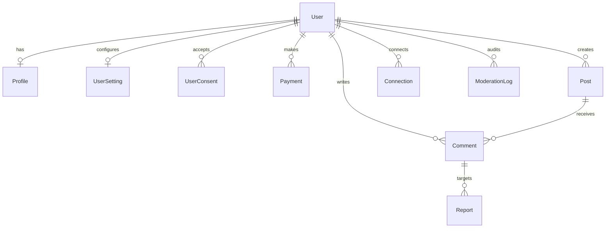
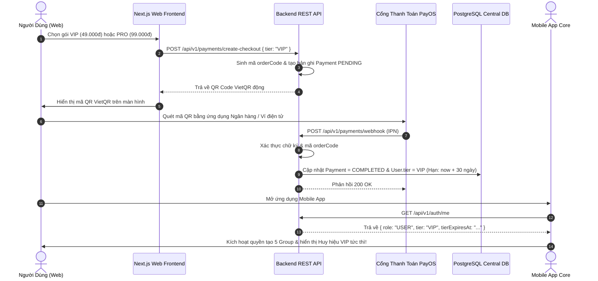

# TÀI LIỆU KIẾN TRÚC HỆ THỐNG & ĐẶC TẢ BACKEND BEEBUDDY

> **Phiên bản:** 1.0.0  
> **Dự án:** BeeBuddy (EXE201)  
> **Kiến trúc:** Monorepo (Next.js 14 Web Frontend + Dedicated Node.js Express REST API + PostgreSQL with Prisma ORM)  
> **Ngày lập:** 2026-09-22

---

## MỤC LỤC

1. [Tổng Quan Dự Án & Ranh Giới Nghiệp Vụ (Scope Matrix)](#1-tổng-quan-dự-án--ranh-giới-nghiệp-vụ)
2. [Cấu Trúc Thư Mục Monorepo](#2-cấu-trúc-thư-mục-monorepo)
3. [Thiết Kế Cơ Sở Dữ Liệu PostgreSQL (Prisma Schema)](#3-thiết-kế-cơ-sở-dữ-liệu-postgresql-prisma-schema)
4. [Kế Hoạch Mở Rộng Schema (Scaling Plan Cho Mobile App Core)](#4-kế-hoạch-mở-rộng-schema-scaling-plan)
5. [Đặc Tả Danh Mục API RESTful (`/api/v1`)](#5-đặc-tả-danh-mục-api-restful)
6. [Luồng Thanh Toán PayOS VietQR & Đồng Bộ Gói Cước (App Sync)](#6-luồng-thanh-toán-payos-vietqr--đồng-bộ-gói-cước)
7. [Cơ Chế Kiểm Duyệt Bình Luận & Bộ Lọc Từ Cấm (Badwords Filter)](#7-cơ-chế-kiểm-duyệt-bình-luận--bộ-lọc-từ-cấm)
8. [Phân Hệ Quản Trị Web (`/admin`)](#8-phân-hệ-quản-trị-web-admin)
9. [Hướng Dẫn Triển Khai & Hosting (Deployment Guide)](#9-hướng-dẫn-triển-khai--hosting)
10. [Hướng Dẫn Khởi Động & Kiểm Thử Hệ Thống (Testing Guide)](#10-hướng-dẫn-khởi-động--kiểm-thử-hệ-thống)

---

## 1. Tổng Quan Dự Án & Ranh Giới Nghiệp Vụ

**BeeBuddy** là nền tảng kết nối bạn bè dựa trên thói quen, sở thích cá nhân và hỗ trợ đồng hành bởi AI Mascot. Hệ thống vận hành trên 2 ứng dụng chính sử dụng chung một cơ sở dữ liệu PostgreSQL tập trung:
- **BeeBuddy Web:** Dành cho giới thiệu thương hiệu, pháp lý, khám phá bài viết công khai, bình luận, nâng cấp gói cước thanh toán VietQR (PayOS), quản lý tài khoản và Phân hệ Quản trị viên (`/admin`).
- **BeeBuddy Mobile App (Core App):** Dành cho trải nghiệm chuyên sâu: Tạo bài viết, nhắn tin 1-1, gọi thoại/video, tạo cộng đồng/nhóm riêng, tương tác Mascot AI và matching bạn bè.

### Ranh Giới Nghiệp Vụ (Web vs. Mobile App Core)

| Phân hệ / Tính năng | BeeBuddy Web (Scope hiện tại) | BeeBuddy Mobile App (Core App) | Cơ chế đồng bộ dữ liệu |
| :--- | :--- | :--- | :--- |
| **Giới thiệu & Pháp lý** | Landing, Cookies consent, Privacy, Terms | Màn hình Splash, Onboarding | Lưu vết `UserConsent` trong PostgreSQL |
| **Đăng ký / Đăng nhập** | Email & Password, JWT Auth | Đầy đủ + Social Login (Google, Apple) | Dùng chung bảng `users` & `auth` |
| **Xem Feed (Bài viết)** | Guest xem bài `PUBLIC`; User xem `PUBLIC` + `CONNECTIONS` | Xem đầy đủ, Stories, Feed cá nhân hóa | Dùng chung bảng `posts` |
| **Đăng bài viết mới** | ❌ Không hỗ trợ trên Web |  Hỗ trợ đăng kèm ảnh/video, tag sở thích | Bài tạo từ App sẽ hiển thị trên Web |
| **Bình luận (Comment)** |  Được bình luận (chạy qua bộ lọc từ cấm) |  Đầy đủ bình luận, reply, reaction | Dùng chung bảng `comments` |
| **Tìm kiếm sở thích** |  Tìm kiếm thói quen, xem số lượng & **preview giới hạn (tối đa 3 thẻ che tên)** |  Tìm kiếm chi tiết, Matching, Đề xuất AI | Web kêu gọi tải App để mở kết nối |
| **Kết nối & Chat (1:1, Nhóm)**| ❌ Không có trên Web |  Chat 1:1, Voice, Call, Group, Mascot AI | Bảng quan hệ bạn bè `connections` |
| **Quản lý Tài khoản & Settings**|  Sửa thông tin cá nhân, avatar, bio, settings |  Cập nhật đầy đủ thông tin chuyên sâu | Cập nhật trên Web sẽ sync ngay sang App |
| **Gói cước & Thanh toán** |  Xem bảng giá, quét VietQR PayOS, nâng cấp VIP/PRO | Xem trạng thái gói, in-app purchase | Nâng cấp trên Web sẽ mở quyền tạo Group trên App |
| **Phân hệ Admin** |  Đầy đủ: Quản trị User, Doanh thu PayOS, Lọc vi phạm | ❌ Không có | Admin thao tác trực tiếp trên `/admin` |

---

## 2. Cấu Trúc Thư Mục Monorepo

Dự án áp dụng cấu trúc Monorepo phân tách rõ ràng:

```
EXE201/
├── app/                           # [FRONTEND] Next.js 14 App Router
│   ├── (auth)/                    # Đăng nhập, đăng ký, quên mật khẩu
│   ├── account/                   # Quản lý hồ sơ cá nhân (User view)
│   ├── billing/                   # Bảng giá gói cước & Thanh toán VietQR
│   ├── community/                 # Social Feed & Bình luận
│   ├── admin/                     # [PHÂN HỆ ADMIN WEB]
│   │   ├── layout.tsx             # Sidebar cố định, Header, Role check status
│   │   ├── page.tsx               # Dashboard tổng quan doanh thu & người dùng
│   │   ├── payments/page.tsx      # Quản lý giao dịch PayOS & Kích hoạt thủ công
│   │   ├── users/page.tsx         # Quản trị tài khoản (Khóa/Mở, Sửa Tier, App stats)
│   │   └── moderation/page.tsx    # Hàng đợi duyệt bình luận vi phạm & Từ cấm
│   └── layout.tsx
├── backend/                       # [BACKEND REST API ĐỘC LẬP]
│   ├── prisma/
│   │   ├── schema.prisma          # PostgreSQL Schema (10 Models)
│   │   └── seed.ts                # Dữ liệu khởi tạo (Admin, Users mẫu, Từ cấm)
│   ├── src/
│   │   ├── config/environment.ts  # Cấu hình biến môi trường (JWT, PayOS, Port)
│   │   ├── common/
│   │   │   ├── filters/           # Bộ lọc từ cấm BadwordsFilter (Regex)
│   │   │   ├── middlewares/       # AuthMiddleware, AdminRoleGuard
│   │   │   └── utils/             # Format phản hồi API chuẩn (ApiResponse)
│   │   ├── modules/               # Domain-Driven Modules
│   │   │   ├── auth/              # Controller, Service, Routes xác thực JWT
│   │   │   ├── account/           # Profile & Settings management
│   │   │   ├── posts/             # Feed, Comments & Tự động gắn cờ vi phạm
│   │   │   ├── search/            # Tìm kiếm sở thích preview giới hạn
│   │   │   ├── payments/          # Xử lý đơn hàng VietQR & PayOS Webhook
│   │   │   ├── legal/             # Ghi nhận Cookie & Điều khoản sử dụng
│   │   │   └── admin/             # Quản trị viên: Metrics, User, Payment, Moderation
│   │   ├── app.ts                 # Express Application & Routes Mounting
│   │   └── server.ts              # Server Entrypoint (Cổng 5000)
│   ├── package.json
│   ├── tsconfig.json
│   └── .env.example
├── components/                    # UI Components tái sử dụng (React)
├── docs/                          # Thư mục chứa tài liệu hệ thống
├── lib/                           # Utility functions & demo states
├── package.json                   # Root Frontend package.json
└── tsconfig.json
```

---

## 3. Thiết Kế Cơ Sở Dữ Liệu PostgreSQL (Prisma Schema)

Toàn bộ CSDL được định nghĩa tại [`backend/prisma/schema.prisma`](file:///home/whopqa/Documents/EXE201/backend/prisma/schema.prisma) gồm **10 models cốt lõi**:



### Chi Tiết Các Model:

1. **`User` (Tài khoản & Phân quyền):**
   - `id`: UUID (Primary Key).
   - `email`: String (Unique, Indexed).
   - `passwordHash`: Chuỗi băm mật khẩu bằng `bcryptjs`.
   - `role`: Enum (`GUEST`, `USER`, `ADMIN`).
   - `tier`: Enum (`FREE`, `VIP`, `PRO`).
   - `tierExpiresAt`: DateTime (Thời hạn gói cước).
   - `isVerified`, `isBanned`, `banReason`.

2. **`Profile` (Hồ sơ người dùng đồng bộ Web & App):**
   - `userId`: Foreign Key tới `User`.
   - `fullName`, `username`, `avatarUrl`, `bio`, `gender`, `dateOfBirth`, `location`.
   - `interests`: Mảng chuỗi sở thích (`String[]`).
   - `habits`: Mảng chuỗi thói quen (`String[]`).
   - `connectionGoal`: Mục tiêu kết nối bạn bè.

3. **`UserSetting` (Cấu hình quyền riêng tư & thông báo):**
   - `profileVisibility`: `PUBLIC`, `CONNECTIONS`, `ONLY_ME`.
   - `emailNotification`, `language`, `theme`.

4. **`Payment` (Giao dịch PayOS VietQR):**
   - `orderCode`: Số nguyên duy nhất đại diện cho đơn hàng PayOS.
   - `userId`: Người thanh toán.
   - `tier`: Gói cước (`VIP` hoặc `PRO`).
   - `durationMonths`: Số tháng mua (mặc định: 1).
   - `amount`: Số tiền (49.000đ hoặc 99.000đ).
   - `status`: `PENDING`, `COMPLETED`, `FAILED`, `CANCELLED`.
   - `checkoutUrl`, `transactionRef`, `paidAt`, `rawWebhookData` (JSONB).

5. **`Post` (Bài viết mạng xã hội):**
   - `authorId`: Tác giả bài viết.
   - `content`, `mediaUrls`, `likesCount`.
   - `visibility`: `PUBLIC`, `CONNECTIONS`, `SELECTED`, `PRIVATE`.

6. **`Comment` (Bình luận mạng xã hội):**
   - `postId`, `authorId`, `content`.
   - `status`: `APPROVED` (Hợp lệ), `FLAGGED` (Chứa từ cấm), `HIDDEN` (Đã bị Admin ẩn).
   - `flagReason`: Lý do vi phạm từ cấm do hệ thống tự phát hiện.

7. **`Report` & `ModerationLog` (Báo cáo & Nhật ký kiểm duyệt):**
   - Ghi nhận mọi báo cáo từ người dùng và nhật ký can thiệp của Quản trị viên (Khóa user, đổi gói, duyệt comment).

8. **`BadWord` (Từ điển từ cấm):**
   - `pattern`: Cụm từ cấm (ví dụ: `lừa đảo`, `scam`, `đm`).
   - `category`: `PROFANITY`, `SCAM`, `HARASSMENT`.
   - `isActive`: Boolean.

9. **`UserConsent` (Pháp lý & Cookies):**
   - Lưu vết người dùng/khách xác nhận Cookie, Privacy Policy, Terms of Service.

10. **`Connection` (Quan hệ kết nối bạn bè):**
    - `userId` và `targetId`, trạng thái `ACCEPTED` (giúp lọc bài viết phạm vi Connections).

---

## 4. Kế Hoạch Mở Rộng Schema (Scaling Plan)

Schema hiện tại đã được thiết kế sẵn sàng để cắm thêm các tính năng của **Mobile App Core** mà **không làm thay đổi hay gãy dữ liệu hiện tại**:

1. **Mở rộng Nhóm & Cộng đồng (Groups & Communities):**
   - Thêm model `Community`, `CommunityMember` và `Group`, `GroupMember`.
   - Kiểm tra logic: User có `tier == FREE` giới hạn tạo 1 nhóm; `tier == VIP` tối đa 5 nhóm; `tier == PRO` không giới hạn tạo cộng đồng.
2. **Mở rộng Nhắn tin thời gian thực (Real-time Chat):**
   - Thêm model `Conversation`, `Message` (hỗ trợ `TEXT`, `IMAGE`, `VOICE`). Tách rời hoàn toàn khỏi Post/Comment.
3. **Mở rộng AI Mascot Chatbot:**
   - Thêm model `MascotMessage` ghi nhận lịch sử tương tác giữa người dùng và trợ lý ảo thông minh.

---

## 5. Đặc Tả Danh Mục API RESTful

Toàn bộ endpoint sử dụng tiền tố: `/api/v1`

### 5.1. Authentication (`/auth`)
- `POST /auth/register`: Đăng ký tài khoản (Email, Mật khẩu, Họ tên).
- `POST /auth/login`: Đăng nhập, trả về Access Token JWT và Refresh Token.
- `POST /auth/refresh`: Làm mới Access Token khi hết hạn.
- `GET /auth/me`: Lấy thông tin user hiện tại kèm Role và Subscription Tier.

### 5.2. Account & Settings (`/account`)
- `GET /account/profile`: Lấy thông tin cá nhân.
- `PUT /account/profile`: Cập nhật Họ tên, Bio, Avatar, Sở thích, Thói quen.
- `PUT /account/password`: Đổi mật khẩu.
- `GET /account/settings`: Lấy cấu hình riêng tư.
- `PUT /account/settings`: Cập nhật cấu hình riêng tư & thông báo.

### 5.3. Social Feed & Comments (`/posts`)
- `GET /posts`: Lấy bài viết (Guest nhận bài `PUBLIC`; User nhận bài `PUBLIC` + bài từ `CONNECTIONS`).
- `GET /posts/:postId/comments`: Lấy bình luận đã được duyệt (`APPROVED`).
- `POST /posts/:postId/comments` *(Yêu cầu User đăng nhập)*:
  - Tự động chạy qua `BadwordsFilter`.
  - Nếu sạch: `status = APPROVED`.
  - Nếu vi phạm: `status = FLAGGED` kèm `flagReason` và tự động gửi vào hàng đợi báo cáo cho Admin.
- `POST /posts/comments/:commentId/report`: Người dùng gửi báo cáo vi phạm thủ công.

### 5.4. Tìm Kiếm Sở Thích Preview Giới Hạn (`/search`)
- `GET /search/preview?q=running`:
  - Trả về `totalMatches` (tổng số người có sở thích này).
  - Trả về tối đa 3 thẻ hồ sơ đã che tên (Masked Name: `Minh N***`).
  - Lời kêu gọi: *"Tải ứng dụng BeeBuddy trên điện thoại để mở khóa toàn bộ kết nối và nhắn tin!"*.
- `GET /search/popular`: Danh sách từ khóa sở thích phổ biến.

### 5.5. Thanh Toán PayOS VietQR (`/payments`)
- `GET /payments/plans`: Xem chi tiết gói cước `VIP` (49.000đ/tháng) và `PRO` (99.000đ/tháng).
- `POST /payments/create-checkout`: Tạo đơn hàng với mã số `orderCode`, trả về đường dẫn thanh toán và mã quét VietQR.
- `POST /payments/webhook`: Webhook endpoint tiếp nhận kết quả từ PayOS, tự động gia hạn `User.tier` và ngày hết hạn.
- `GET /payments/status/:orderCode`: Kiểm tra trạng thái đơn hàng.
- `GET /payments/my-history`: Xem lịch sử giao dịch cá nhân.

### 5.6. Phân Hệ Quản Trị Viên (`/admin`) *(Yêu cầu `role: ADMIN`)*
- `GET /admin/metrics`: Số liệu tổng quan (Doanh thu PayOS, tổng người dùng, số lượng VIP/PRO, bình luận cần duyệt).
- `GET /admin/users`: Danh sách người dùng, tìm kiếm theo tên/email, lọc theo gói cước hoặc trạng thái khóa.
- `PUT /admin/users/:id/ban`: Khóa tài khoản kèm lý do vi phạm.
- `PUT /admin/users/:id/unban`: Mở khóa tài khoản.
- `PUT /admin/users/:id/tier`: Điều chỉnh thủ công gói cước cho người dùng.
- `GET /admin/payments`: Toàn bộ lịch sử giao dịch thanh toán PayOS.
- `GET /admin/moderation/comments`: Danh sách bình luận bị gắn cờ `FLAGGED`.
- `PUT /admin/moderation/comments/:id`: Thao tác Duyệt hiển thị (`APPROVED`) hoặc Ẩn vĩnh viễn (`HIDDEN`).
- `GET /admin/badwords`: Danh sách từ cấm.
- `POST /admin/badwords`: Thêm từ cấm mới.
- `DELETE /admin/badwords/:id`: Xóa từ cấm.

---

## 6. Luồng Thanh Toán PayOS VietQR & Đồng Bộ Gói Cước



---

## 7. Cơ Chế Kiểm Duyệt Bình Luận & Bộ Lọc Từ Cấm

- Khi người dùng gửi bình luận qua API `POST /api/v1/posts/:id/comments`, nội dung được chạy qua module [`BadwordsFilter`](file:///home/whopqa/Documents/EXE201/backend/src/common/filters/badwords.filter.ts).
- Bộ lọc kết hợp **Danh bạ từ cấm lưu trong PostgreSQL** (`prisma.badWord`) và cơ chế Regex Boundary để nhận diện từ ngữ tục tĩu (`PROFANITY`), lừa đảo/scam (`SCAM`) hoặc quấy rối (`HARASSMENT`).
- **Xử lý vi phạm:**
  - Bình luận vi phạm nhận trạng thái `status = FLAGGED` và bị ẩn khỏi Feed thông thường.
  - Hệ thống tự động tạo bản ghi trong bảng `Report`.
  - Bình luận xuất hiện ngay trên trang `/admin/moderation` để Quản trị viên xem xét và bấm nút Duyệt hoặc Ẩn vĩnh viễn.

---

## 8. Phân Hệ Quản Trị Web (`/admin`)

Phân hệ Quản trị viên được tích hợp trực tiếp vào dự án Next.js tại thư mục [`app/admin`](file:///home/whopqa/Documents/EXE201/app/admin) với layout tách biệt:
- **Trang Tổng Quan (`/admin`):** Hiển thị doanh thu PayOS, tổng người dùng, tỷ lệ chuyển đổi và banner xác nhận đồng bộ Web ↔ App Core.
- **Trang Quản Lý Giao Dịch (`/admin/payments`):** Bảng danh sách đơn hàng PayOS, đối soát doanh thu và nút kích hoạt gói cước thủ công khi cần can thiệp CSKH.
- **Trang Quản Trị Tài Khoản (`/admin/users`):** Tra cứu thông tin hồ sơ, thói quen sở thích, số kết nối bạn bè trên App, thao tác khóa tài khoản (kèm popup nhập lý do) và điều chỉnh gói cước trực tiếp.
- **Trang Kiểm Duyệt (`/admin/moderation`):** Hàng đợi xử lý bình luận vi phạm và giao diện quản lý Thêm/Xóa từ cấm trong từ điển hệ thống.

---

## 9. Hướng Dẫn Triển Khai & Hosting

### 9.1. Cơ Sở Dữ Liệu: Supabase hoặc Neon.tech
1. Đăng ký tài khoản miễn phí tại [supabase.com](https://supabase.com) hoặc [neon.tech](https://neon.tech).
2. Tạo project PostgreSQL mới.
3. Lấy chuỗi kết nối dạng:
   ```env
   DATABASE_URL="postgresql://postgres:[YOUR_PASSWORD]@[YOUR_HOST]:5432/[DB_NAME]?schema=public"
   ```
4. Điền vào file `backend/.env`.

### 9.2. Triển Khai Backend REST API: Render.com / Railway
1. Đẩy mã nguồn lên GitHub.
2. Tạo dịch vụ Web Service mới trên Render / Railway, trỏ thư mục gốc vào `backend`.
3. Cấu hình lệnh Build & Start:
   - **Build Command:** `npm install && npx prisma generate && npm run build`
   - **Start Command:** `npm start`
4. Cung cấp các biến môi trường: `DATABASE_URL`, `JWT_SECRET`, `PAYOS_CLIENT_ID`, `PAYOS_API_KEY`, `PAYOS_CHECKSUM_KEY`.

### 9.3. Triển Khai Frontend Web: Vercel
1. Import repository lên [vercel.com](https://vercel.com).
2. Framework Preset: **Next.js**.
3. Cấu hình biến môi trường trỏ API:
   ```env
   NEXT_PUBLIC_API_URL="https://your-backend-service.onrender.com/api/v1"
   ```

---

## 10. Hướng Dẫn Khởi Động & Kiểm Thử Hệ Thống

### 10.1. Khởi động môi trường phát triển (Local)

Mở 2 cửa sổ Terminal:

**Terminal 1 (Backend API):**
```bash
cd backend
npm install
npx prisma generate
npx prisma db push
npm run prisma:seed    # Khởi tạo Admin và dữ liệu mẫu
npm run dev            # Lắng nghe tại http://localhost:5000
```

**Terminal 2 (Frontend Web):**
```bash
npm install
npm run dev            # Truy cập tại http://localhost:3000
```

### 10.2. Tài khoản thử nghiệm mặc định sau khi seed:
- **Tài khoản Admin:** `admin@beebuddy.vn` / Mật khẩu: `admin123456`  
  👉 Truy cập: `http://localhost:3000/admin`
- **Tài khoản VIP:** `minh.nguyen@beebuddy.vn` / Mật khẩu: `user123456`
- **Tài khoản PRO:** `trang.le@beebuddy.vn` / Mật khẩu: `user123456`

---
*Tài liệu được biên soạn và bảo trì bởi Đội ngũ Kỹ thuật BeeBuddy.*
